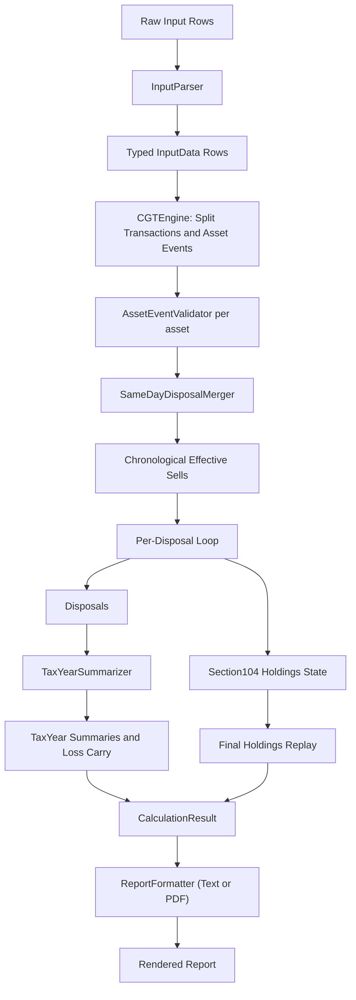
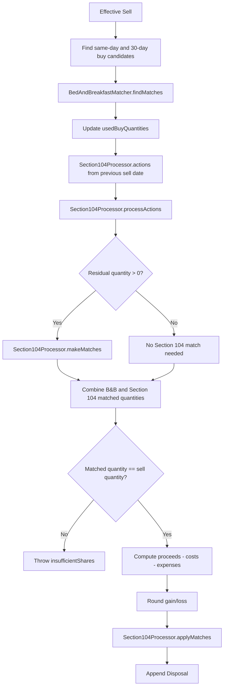

# cgtcalc Architecture

## Overview

`cgtcalc` is a Swift command-line calculator for UK capital gains on shares/funds.

Design goals:
- explicit tax-rule implementation
- deterministic, explainable output
- focused units with direct tests
- thin CLI over a pure calculation library

Repository shape:

```text
cgtcalc-swift2/
├── Sources/
│   ├── CGTCalcCore/
│   └── cgtcalc/
└── Tests/
    ├── CGTCalcCoreTests/
    └── cgtcalcTests/
```

## Core Components

### Parser

`InputParser`:
- parses text rows into typed transactions/events
- performs structural validation (field shape and simple numeric constraints)
- enforces strict decimal token grammar (optional `£`, valid thousands separators, no scientific notation)
- assigns source-order metadata for deterministic tie-breaking

### Calculator Orchestrator

`CGTEngine`:
- normalizes/splits inputs
- validates per-asset distribution semantics
- runs matching and pooling pipeline chronologically
- builds disposals, summaries, and final holdings

### Focused Calculator Units

- `SameDayDisposalMerger`: merges same-asset same-day sells before rounding
- `BedAndBreakfastMatcher`: same-day and 30-day matching, restructure-aware quantity handling, post-buy event adjustments
- `Section104Processor`: pooled action replay, Section 104 pricing, pool depletion
- `AssetEventValidator`: grouped same-day amount validation and Group II checks
- `TaxYearSummarizer`: gain/loss aggregation, exemption handling, loss carry behavior

### Formatter

`ReportFormatter`:
- formatter abstraction used by the CLI for selectable output modes

`TextReportFormatter`:
- default text report renderer
- renders summary, tax-year details, tax-return info, holdings, transactions, and asset events
- preserves input order in rendered transactions/events

`PDFReportFormatter` (macOS-only):
- renders a styled PDF report with the same high-level sections as text output
- receives calculation results directly (not text-as-PDF conversion)

### CLI

`cgtcalc` executable:
- reads file or stdin (`-`)
- runs parse + calculate + format
- supports formatter selection via `--format` (`text` on all platforms, `pdf` on macOS)
- writes to stdout or optional output file

## Domain Model Highlights

- `Transaction`: `BUY`/`SELL` with date, asset, quantity, price, expenses
- `AssetEvent`: `CAPRETURN`, `DIVIDEND`, `SPLIT`, `UNSPLIT`, `RESTRUCT`
- `Disposal`: effective sell, rounded gain/loss, B&B matches, Section 104 matches
- `Section104Holding`: pooled quantity/cost and provenance entries
- `TaxYear`: UK tax-year boundary model and label logic

Current event semantics:
- `DIVIDEND` means accumulation distribution in this codebase
- `CAPRETURN` reduces pooled allowable cost
- same-day grouped `DIVIDEND`/`CAPRETURN` amount validation is enforced

## Processing Pipeline

1. Parse and structurally validate inputs.
2. Group/sort by asset and date with deterministic tie-breaking.
3. Merge same-day same-asset sells.
4. For each effective sell:
- apply same-day and 30-day matching
- replay Section 104 actions since prior sell
- price unmatched remainder via pooled average cost
- reject oversells when full quantity cannot be matched
5. Build per-tax-year summaries and remaining carried loss.
6. Replay post-last-sale actions for final holdings.
7. Render report.

## Engine Internals

### End-to-End Engine Dataflow



### Core Engine State

`CGTEngine` manages two key mutable states while iterating disposals:
- `usedBuyQuantities`: tracks buy quantities already consumed by same-day/B&B matches
- `section104Holdings`: live pooled state per asset across disposal boundaries

That state is what ensures:
- buy quantities are not reused across multiple matching passes
- Section 104 pricing uses the correct pool at each disposal date
- final holdings reflect all remaining post-disposal actions

### Per-Disposal Execution Loop

For each effective sell (already merged by same-day same-asset rules), the engine does:

1. Collect same-day and 30-day candidate buys for the asset.
2. Run `BedAndBreakfastMatcher` and record matched quantities in `usedBuyQuantities`.
3. Rebuild Section 104 state from last sale date to this sell date with `Section104Processor.actions` + `processActions`.
4. Price any residual sell quantity through `Section104Processor.makeMatches`.
5. Verify full quantity matched; throw oversell error if not.
6. Compute raw gain and apply project rounding rule.
7. Apply matched Section 104 depletion to live holding state.
8. Append final `Disposal` record.



### Why the Split into Focused Units Matters

- `BedAndBreakfastMatcher` stays focused on identification and matched-cost composition.
- `Section104Processor` stays focused on chronological pool replay and average-cost pricing.
- `AssetEventValidator` owns entitlement-style quantity checks, independent from pool matching.

This separation keeps rule behavior explicit and testable without coupling unrelated state concerns.

## Testing Strategy

Layered test suite:
- parser unit tests
- focused unit tests per calculator component
- engine smoke tests
- golden end-to-end example tests
- golden end-to-end invalid-input tests
- CLI formatter tests (`Tests/cgtcalcTests`) for formatter behavior

Principle:
- test behavior at the narrowest useful seam first
- keep fixture-based integration tests for high-value end-to-end guarantees

## Current Assumptions and Boundaries

Assumptions:
- input dates represent effective dates for matching/event semantics
- supported scope is share/fund-style disposal matching under current implemented rules
- all monetary input values are already GBP

Intentional boundaries:
- no GUI/persistence/network layers
- no filing integration
- no full tax-payable model based on taxpayer income context
- no broad support for other asset regimes outside current scope
- no currency conversion / FX-rate lookup inside calculator paths

## Future Improvement Areas

- richer invalid-input fixture coverage and clearer error-stability guarantees
- deeper formatter test coverage for tax-return detail edge cases
- clearer special-year rate-change treatment in tax-return presentation
- continued parser/calculator boundary refinement for validation ownership
